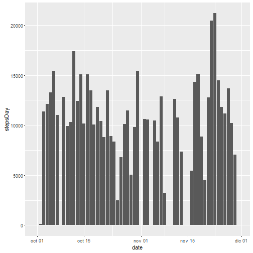
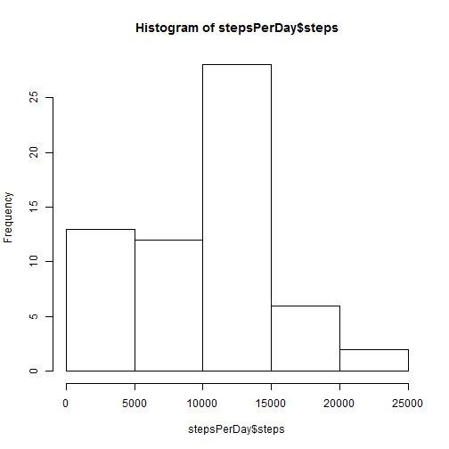
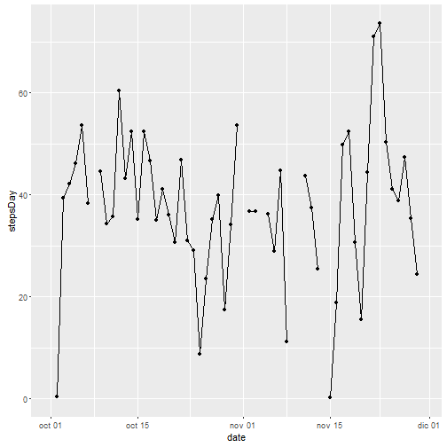
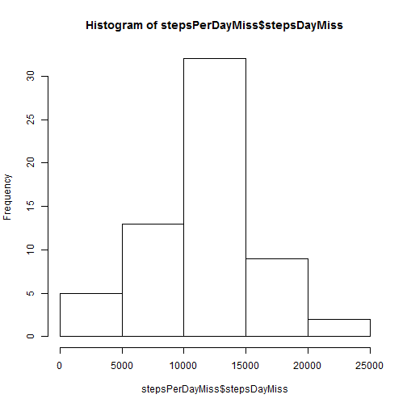
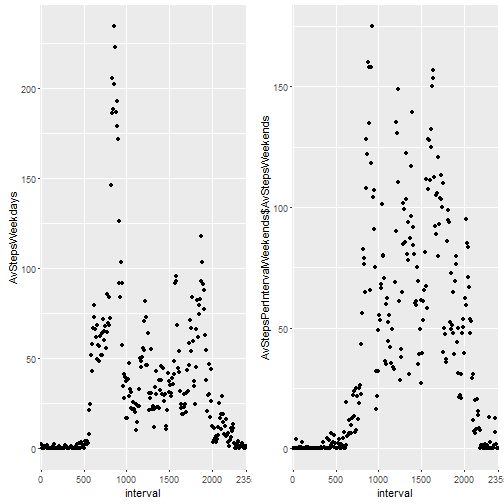

Assignment: Course Project 1
========================================================

This is an R Markdown document that contains the complete report for Assignment 1 of Reproducible Research subject (Cousera Data Science Specialization)

The answers are:

(1) Code for reading in the dataset and/or processing the data

We start by calling some libraries needed for the entire assignment

```r
library(plyr)
library(ggplot2)
library(scales)
library(timeDate)
library(Rmisc)
```

```
## Loading required package: lattice
```

```r
library(mice)
```

```
## Loading required package: Rcpp
```

```
## mice 2.25 2015-11-09
```

```r
##library(VIM)
```

We read the csv file and save it as the main data frame


```r
mydata<-read.csv("activity.csv")
```

stepsPerDay is a data frame that contains the sum of steps per each day in mydata


```r
stepsPerDay<-ddply(mydata, .(date), summarise, stepsDay = sum(steps, na.rm = TRUE))
```

This is the head of stepsPerDay:


```r
head(stepsPerDay)
```

```
##         date stepsDay
## 1 2012-10-01        0
## 2 2012-10-02      126
## 3 2012-10-03    11352
## 4 2012-10-04    12116
## 5 2012-10-05    13294
## 6 2012-10-06    15420
```

For processing, it is needed to set a date format to the date column of strings:


```r
stepsPerDay$date<-as.Date(stepsPerDay$date)
```

(2) Now, the histogram plot is created with dates in x axis and steps count on y axis

```r
plot2<-ggplot(stepsPerDay, aes(x=date, y=stepsDay)) + geom_bar(stat="identity")
plot2
```



```r
hist(stepsPerDay$steps)
```




(3) We calculate Mean and median number of steps taken each day, removing the NA values


```r
stepsMeanPerDay<-ddply(mydata, "date", summarise, stepsDay = mean(steps, na.rm = TRUE))
stepsMedianPerDay<-ddply(mydata, "date", summarise, stepsDay = median(steps, na.rm = TRUE))
head(stepsMeanPerDay)
```

```
##         date stepsDay
## 1 2012-10-01      NaN
## 2 2012-10-02  0.43750
## 3 2012-10-03 39.41667
## 4 2012-10-04 42.06944
## 5 2012-10-05 46.15972
## 6 2012-10-06 53.54167
```

```r
head(stepsMedianPerDay)
```

```
##         date stepsDay
## 1 2012-10-01       NA
## 2 2012-10-02        0
## 3 2012-10-03        0
## 4 2012-10-04        0
## 5 2012-10-05        0
## 6 2012-10-06        0
```

```r
mean(stepsPerDay$stepsDay,na.rm=TRUE)
```

```
## [1] 9354.23
```

```r
median(stepsPerDay$stepsDay,na.rm=TRUE)
```

```
## [1] 10395
```

(4) We create a time series plot of the average number of steps taken, giving date format to the date column of strings 


```r
stepsMeanPerDay$date<-as.Date(stepsMeanPerDay$date)
plot3<-qplot( data=stepsMeanPerDay, x = date, y = stepsDay,stat="identity")
```

```
## Warning: `stat` is deprecated
```

```r
plot3 + geom_line()
```

```
## Warning: Removed 8 rows containing missing values (geom_point).
```

```
## Warning: Removed 2 rows containing missing values (geom_path).
```



(5) The 5-minute interval that, on average, contains the maximum number of steps, is located this way:

"mydata5" data frame is created. It contains the mean steps for each interval


```r
mydata5<-mydata
mydata5$interval<-as.factor(mydata5$interval)
maxStepsPerInterval<-ddply(mydata5, "interval", summarise, maxAvSteps = mean(steps, na.rm = TRUE))
head(maxStepsPerInterval)
```

```
##   interval maxAvSteps
## 1        0  1.7169811
## 2        5  0.3396226
## 3       10  0.1320755
## 4       15  0.1509434
## 5       20  0.0754717
## 6       25  2.0943396
```

Now, we can know the interval with the maximum average steps:


```r
maxStepsPerInterval[max(maxStepsPerInterval$maxAvSteps),]
```

```
##     interval maxAvSteps
## 206     1705   56.30189
```

(6) Code and strategy for imputing missing data

The mice package provides function md.pattern() to get a better understanding of the pattern of missing data


```r
md.pattern(mydata)
```

```
##       date interval steps     
## 15264    1        1     1    0
##  2304    1        1     0    1
##          0        0  2304 2304
```

The mice() function takes care of the imputing process. Thispackage helps imputing missing values with plausible data values. These plausible values are drawn from a distribution specifically designed for each missing datapoint.


```r
tempData <- mice(mydata,m=5,maxit=50,meth='pmm',seed=500)
```

```
## 
##  iter imp variable
##   1   1  steps
##   1   2  steps
##   1   3  steps
##   1   4  steps
##   1   5  steps
##   2   1  steps
##   2   2  steps
##   2   3  steps
##   2   4  steps
##   2   5  steps
##   3   1  steps
##   3   2  steps
##   3   3  steps
##   3   4  steps
##   3   5  steps
##   4   1  steps
##   4   2  steps
##   4   3  steps
##   4   4  steps
##   4   5  steps
##   5   1  steps
##   5   2  steps
##   5   3  steps
##   5   4  steps
##   5   5  steps
##   6   1  steps
##   6   2  steps
##   6   3  steps
##   6   4  steps
##   6   5  steps
##   7   1  steps
##   7   2  steps
##   7   3  steps
##   7   4  steps
##   7   5  steps
##   8   1  steps
##   8   2  steps
##   8   3  steps
##   8   4  steps
##   8   5  steps
##   9   1  steps
##   9   2  steps
##   9   3  steps
##   9   4  steps
##   9   5  steps
##   10   1  steps
##   10   2  steps
##   10   3  steps
##   10   4  steps
##   10   5  steps
##   11   1  steps
##   11   2  steps
##   11   3  steps
##   11   4  steps
##   11   5  steps
##   12   1  steps
##   12   2  steps
##   12   3  steps
##   12   4  steps
##   12   5  steps
##   13   1  steps
##   13   2  steps
##   13   3  steps
##   13   4  steps
##   13   5  steps
##   14   1  steps
##   14   2  steps
##   14   3  steps
##   14   4  steps
##   14   5  steps
##   15   1  steps
##   15   2  steps
##   15   3  steps
##   15   4  steps
##   15   5  steps
##   16   1  steps
##   16   2  steps
##   16   3  steps
##   16   4  steps
##   16   5  steps
##   17   1  steps
##   17   2  steps
##   17   3  steps
##   17   4  steps
##   17   5  steps
##   18   1  steps
##   18   2  steps
##   18   3  steps
##   18   4  steps
##   18   5  steps
##   19   1  steps
##   19   2  steps
##   19   3  steps
##   19   4  steps
##   19   5  steps
##   20   1  steps
##   20   2  steps
##   20   3  steps
##   20   4  steps
##   20   5  steps
##   21   1  steps
##   21   2  steps
##   21   3  steps
##   21   4  steps
##   21   5  steps
##   22   1  steps
##   22   2  steps
##   22   3  steps
##   22   4  steps
##   22   5  steps
##   23   1  steps
##   23   2  steps
##   23   3  steps
##   23   4  steps
##   23   5  steps
##   24   1  steps
##   24   2  steps
##   24   3  steps
##   24   4  steps
##   24   5  steps
##   25   1  steps
##   25   2  steps
##   25   3  steps
##   25   4  steps
##   25   5  steps
##   26   1  steps
##   26   2  steps
##   26   3  steps
##   26   4  steps
##   26   5  steps
##   27   1  steps
##   27   2  steps
##   27   3  steps
##   27   4  steps
##   27   5  steps
##   28   1  steps
##   28   2  steps
##   28   3  steps
##   28   4  steps
##   28   5  steps
##   29   1  steps
##   29   2  steps
##   29   3  steps
##   29   4  steps
##   29   5  steps
##   30   1  steps
##   30   2  steps
##   30   3  steps
##   30   4  steps
##   30   5  steps
##   31   1  steps
##   31   2  steps
##   31   3  steps
##   31   4  steps
##   31   5  steps
##   32   1  steps
##   32   2  steps
##   32   3  steps
##   32   4  steps
##   32   5  steps
##   33   1  steps
##   33   2  steps
##   33   3  steps
##   33   4  steps
##   33   5  steps
##   34   1  steps
##   34   2  steps
##   34   3  steps
##   34   4  steps
##   34   5  steps
##   35   1  steps
##   35   2  steps
##   35   3  steps
##   35   4  steps
##   35   5  steps
##   36   1  steps
##   36   2  steps
##   36   3  steps
##   36   4  steps
##   36   5  steps
##   37   1  steps
##   37   2  steps
##   37   3  steps
##   37   4  steps
##   37   5  steps
##   38   1  steps
##   38   2  steps
##   38   3  steps
##   38   4  steps
##   38   5  steps
##   39   1  steps
##   39   2  steps
##   39   3  steps
##   39   4  steps
##   39   5  steps
##   40   1  steps
##   40   2  steps
##   40   3  steps
##   40   4  steps
##   40   5  steps
##   41   1  steps
##   41   2  steps
##   41   3  steps
##   41   4  steps
##   41   5  steps
##   42   1  steps
##   42   2  steps
##   42   3  steps
##   42   4  steps
##   42   5  steps
##   43   1  steps
##   43   2  steps
##   43   3  steps
##   43   4  steps
##   43   5  steps
##   44   1  steps
##   44   2  steps
##   44   3  steps
##   44   4  steps
##   44   5  steps
##   45   1  steps
##   45   2  steps
##   45   3  steps
##   45   4  steps
##   45   5  steps
##   46   1  steps
##   46   2  steps
##   46   3  steps
##   46   4  steps
##   46   5  steps
##   47   1  steps
##   47   2  steps
##   47   3  steps
##   47   4  steps
##   47   5  steps
##   48   1  steps
##   48   2  steps
##   48   3  steps
##   48   4  steps
##   48   5  steps
##   49   1  steps
##   49   2  steps
##   49   3  steps
##   49   4  steps
##   49   5  steps
##   50   1  steps
##   50   2  steps
##   50   3  steps
##   50   4  steps
##   50   5  steps
```

```r
completedData <- complete(tempData,1)
head(completedData)
```

```
##   steps       date interval
## 1     0 2012-10-01        0
## 2     0 2012-10-01        5
## 3    20 2012-10-01       10
## 4     0 2012-10-01       15
## 5     0 2012-10-01       20
## 6     0 2012-10-01       25
```

(7) Histogram of the total number of steps taken each day after missing values are imputed

stepsPerDayMiss is a data frame that contains the sum of steps per each day in completedData, after missing values are imputed


```r
stepsPerDayMiss<-ddply(completedData, .(date), summarise, stepsDayMiss = sum(steps, na.rm = TRUE))
```


We have to give date format to the date column of strings

```r
stepsPerDayMiss$date<-as.Date(stepsPerDayMiss$date)
```


The histogram plot is created with dates in x axis and steps count on y axis


```r
plot7<-qplot( data=stepsPerDayMiss, x = date, y = stepsDayMiss, geom = "histogram", stat="identity")
```

```
## Warning: `stat` is deprecated
```

Showing the histogram on screen, formating x axis to months

```r
plot7 + scale_x_date(breaks = date_breaks("months"),labels = date_format("%b"))
```

```
## Error: stat_bin() must not be used with a y aesthetic.
```


The Final Histogram is:

```r
hist(stepsPerDayMiss$stepsDayMiss)
```



(8) Panel plot comparing the average number of steps taken per 5-minute interval across weekdays and weekends

We start by discerning weekdays and weekends, according to the dates given. After that, we can add this column (weekday=TRUE and weekend=FALSE) to a new data frame.

This new data frame is processed and subsetted according to weekdays and weekends.

Finally, "dataFrame7" is created. The latter contains interval and steps- averages for weekends and weekdays, based on the previous processing code of question 5.

With dataFrame7, we proceed to create panel plots where we can see the differences in averages for weekends and weekdays


```r
weekdayTRUEweekendFALSE<-isWeekday(mydata5$date)
mydata8<-cbind(mydata5,weekdayTRUEweekendFALSE)

subsetWeekdays<-mydata8[weekdayTRUEweekendFALSE=="TRUE",]
subsetWeekends<-mydata8[weekdayTRUEweekendFALSE=="FALSE",]

AvStepsPerIntervalWeekdays<-ddply(subsetWeekdays, "interval", summarise, AvStepsWeekdays = mean(steps, na.rm = TRUE))
AvStepsPerIntervalWeekends<-ddply(subsetWeekends, "interval", summarise, AvStepsWeekends = mean(steps, na.rm = TRUE))

dataFrame7<-cbind(AvStepsPerIntervalWeekdays,AvStepsPerIntervalWeekends$AvStepsWeekends)

plot8Weekdays<-ggplot(dataFrame7, aes(x=interval, y=AvStepsWeekdays)) + geom_point()+scale_x_discrete(breaks=c(0, 500, 1000, 1500, 2000,2355))

plot8Weekends<-ggplot(dataFrame7, aes(x=interval, y=AvStepsPerIntervalWeekends$AvStepsWeekends)) + geom_point()+scale_x_discrete(breaks=c(0, 500, 1000, 1500, 2000,2355))

multiplot(plot8Weekdays,plot8Weekends,cols=2)
```




